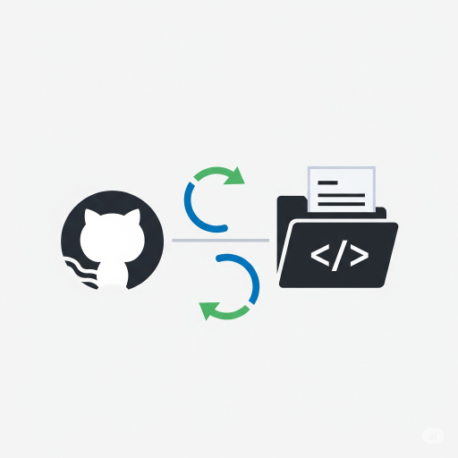

<!-- Improved compatibility of back to top link: See: https://github.com/othneildrew/Best-README-Template/pull/73 -->

[![Contributors][contributors-shield]][contributors-url]
[![Forks][forks-shield]][forks-url]
[![Stargazers][stars-shield]][stars-url]
[![Issues][issues-shield]][issues-url]
[![MIT License][license-shield]][license-url]

 

  

<h3 align="center">Github-Forks-Sync-Manager</h3>

  

    Automate the synchronization of all forked repositories for a GitHub account with their upstream sources using GitHub Actions and Python.
     
    <a href="https://github.com/LoveDoLove/Github-Forks-Sync-Manager"><strong>Explore the docs »</strong></a>
     
     
    <a href="https://github.com/LoveDoLove/Github-Forks-Sync-Manager">View Demo</a>
    &middot;
    <a href="https://github.com/LoveDoLove/Github-Forks-Sync-Manager/issues/new?labels=bug&template=bug-report---.md">Report Bug</a>
    &middot;
    <a href="https://github.com/LoveDoLove/Github-Forks-Sync-Manager/issues/new?labels=enhancement&template=feature-request---.md">Request Feature</a>
  

<!-- TABLE OF CONTENTS -->

  
Table of Contents

  <ol>
    <li>
      <a href="#about-the-project">About The Project</a>
      <ul>
        <li><a href="#built-with">Built With</a></li>
      </ul>
    </li>
    <li>
      <a href="#getting-started">Getting Started</a>
      <ul>
        <li><a href="#prerequisites">Prerequisites</a></li>
        <li><a href="#installation">Installation</a></li>
      </ul>
    </li>
    <li><a href="#usage">Usage</a></li>
    <li><a href="#contributing">Contributing</a></li>
    <li><a href="#license">License</a></li>
    <li><a href="#contact">Contact</a></li>
    <li><a href="#acknowledgments">Acknowledgments</a></li>
  </ol>

<!-- ABOUT THE PROJECT -->

## About The Project

Github-Forks-Sync-Manager provides a GitHub Actions workflow and Python script to automate the process of updating all forked repositories for a specified GitHub account, ensuring they are always in sync with their upstream sources. This is useful for developers and organizations who maintain many forks and want to keep them up-to-date automatically.

(<a href="#readme-top">back to top</a>)

### Built With

- [GitHub Actions](https://docs.github.com/en/actions)
- [Python](https://www.python.org/)
- [requests](https://pypi.org/project/requests/)
- [actions/checkout](https://github.com/actions/checkout)
- [actions/setup-python](https://github.com/actions/setup-python)

(<a href="#readme-top">back to top</a>)

<!-- GETTING STARTED -->

## Getting Started

To use this workflow in your own repository, follow the steps below.

### Prerequisites

- A GitHub repository with Actions enabled.
- A GitHub account with forked repositories you want to keep in sync.
- A Personal Access Token with repo access, stored as a secret named `GH_PAT`.

### Installation

1. Copy the [`workflows/github-forks-sync.yml`](workflows/github-forks-sync.yml) file into your repository's `.github/workflows/` directory.
2. Ensure your repository has a `GH_PAT` secret (Personal Access Token with repo access).
3. Commit and push the changes to your repository.

(<a href="#readme-top">back to top</a>)

<!-- USAGE EXAMPLES -->

## Usage

- Go to the "Actions" tab in your repository.
- Select "Sync All Forked Repositories with Upstream".
- Click "Run workflow" and enter the GitHub account username you want to update forks for.
- The workflow will:
  - Fetch all forked repositories for the specified account.
  - Attempt to update each fork to match its upstream source.

_You can also schedule this workflow or trigger it via the API as needed._

(<a href="#readme-top">back to top</a>)

<!-- CONTRIBUTING -->

## Contributing

Contributions are what make the open source community such an amazing place to learn, inspire, and create. Any contributions you make are **greatly appreciated**.

If you have a suggestion that would make this better, please fork the repo and create a pull request. You can also simply open an issue with the tag "enhancement".  
Don't forget to give the project a star! Thanks again!

1. Fork the Project
2. Create your Feature Branch (`git checkout -b feature/AmazingFeature`)
3. Commit your Changes (`git commit -m 'Add some AmazingFeature'`)
4. Push to the Branch (`git push origin feature/AmazingFeature`)
5. Open a Pull Request

(<a href="#readme-top">back to top</a>)

### Top contributors:

<!-- LICENSE -->

## License

Distributed under the MIT License. See [`LICENSE`](LICENSE) for more information.

(<a href="#readme-top">back to top</a>)

<!-- CONTACT -->

## Contact

LoveDoLove - [@LoveDoLove](https://github.com/LoveDoLove)

Project Link: [https://github.com/LoveDoLove/Github-Forks-Sync-Manager](https://github.com/LoveDoLove/Github-Forks-Sync-Manager)

(<a href="#readme-top">back to top</a>)

<!-- ACKNOWLEDGMENTS -->

## Acknowledgments

- [actions/checkout](https://github.com/actions/checkout)
- [actions/setup-python](https://github.com/actions/setup-python)
- [requests](https://pypi.org/project/requests/)
- [GitHub Actions Documentation](https://docs.github.com/en/actions)
- [Best README Template](https://github.com/othneildrew/Best-README-Template)

(<a href="#readme-top">back to top</a>)

<!-- MARKDOWN LINKS & IMAGES -->

[contributors-shield]: https://img.shields.io/github/contributors/LoveDoLove/Github-Forks-Sync-Manager.svg?style=for-the-badge
[contributors-url]: https://github.com/LoveDoLove/Github-Forks-Sync-Manager/graphs/contributors
[forks-shield]: https://img.shields.io/github/forks/LoveDoLove/Github-Forks-Sync-Manager.svg?style=for-the-badge
[forks-url]: https://github.com/LoveDoLove/Github-Forks-Sync-Manager/network/members
[stars-shield]: https://img.shields.io/github/stars/LoveDoLove/Github-Forks-Sync-Manager.svg?style=for-the-badge
[stars-url]: https://github.com/LoveDoLove/Github-Forks-Sync-Manager/stargazers
[issues-shield]: https://img.shields.io/github/issues/LoveDoLove/Github-Forks-Sync-Manager.svg?style=for-the-badge
[issues-url]: https://github.com/LoveDoLove/Github-Forks-Sync-Manager/issues
[license-shield]: https://img.shields.io/github/license/LoveDoLove/Github-Forks-Sync-Manager.svg?style=for-the-badge
[license-url]: https://github.com/LoveDoLove/Github-Forks-Sync-Manager/blob/master/LICENSE
[linkedin-shield]: https://img.shields.io/badge/-LinkedIn-black.svg?style=for-the-badge&logo=linkedin&colorB=555
[linkedin-url]: https://linkedin.com/in/linkedin_username
[product-screenshot]: images/logo.png
